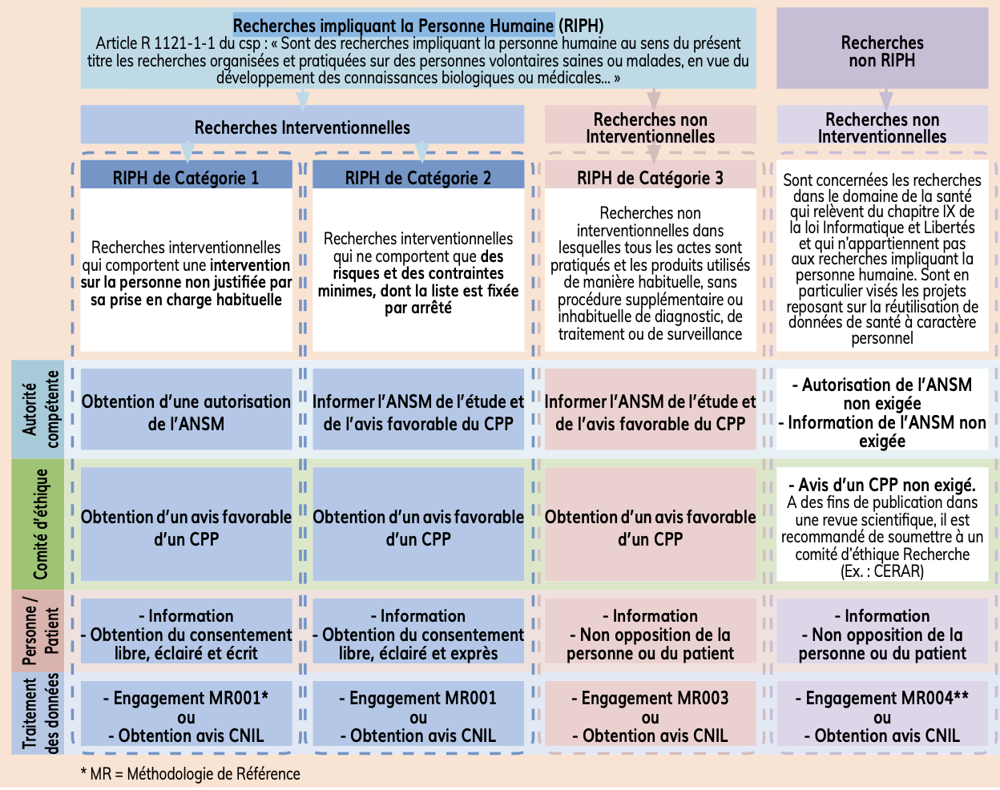

Les recherches menées sur la personne humaine doivent répondre à de nombreux critères organisationnels et éthiques, encadrés par la loi, pour garantir la sécurité des participants. Ce dispositif s'appuie sur une réflexion approfondie visant à protéger la personne participant à une recherche, quelle qu’elle soit (mineur, majeur protégé, majeur, personne malade ou vulnérable, volontaire sain), ainsi que ses données et ses prélèvements biologiques (sang, tissus, organes). L'intérêt des personnes doit toujours primer sur ceux de la science et de la société.  
  
Acronymes :  
- ANSM : Agence nationale de sécurité du médicament et des produits de santé  
- CPP : Comité Protection des Personnes  
- CNIL : Commission nationale de l'informatique et des libertés  
- URC : Unité de Recherche Clinique  
- BPC : Bonnes Pratiques Cliniques  
- CRF : Case report form  
- INDS : Institut national des données de santé 
- CERAPHP : Comité d'éthique de la recherche AP-HP.5  
  
# Sommaire
1. [RIPH 1 : Interventionnelle  impliquant la personne humaine](#RIPH1)
2. [RIPH 2 : Interventionnelle à risques et contraintes minimes](#RIPH2)
3. [RIPH 3 :  Impliquant la personne humaine, non interventionnelle](#RIPH3)
4. [Hors loi Jardé : n'impliquant pas la personne humaine](#liensutiles)
5. [Liens utiles](#horsjarde)
 

  
    

### **RIPH 1 : Interventionnelle  impliquant la personne humaine**  
Recherches interventionnelles qui comportent une **intervention sur la personne non justifiée par sa prise en charge habituelle.** (médicaments, actes chirurgicaux, des dispositifs médicaux, thérapies cellulaires ou géniques)   
[Déroulement d'un essai clinique](https://www.inserm.fr/recherche-inserm/recherche-clinique/essais-cliniques-recherches-interventionnelles-portant-sur-produit-sante)    
  
Checklist de conformite des recherches impliquant la personne humaine necessitant le recueil du consentement de la personne concernee (MR001) :   
Si votre traitement répond à ces trois critères, vous pouvez débuter le remplissage du formulaire :  
- la recherche a pour but d’évaluer les mécanismes de fonctionnement de l’organisme humain ou l’efficacité et la sécurité d’actes ou de produits;  
- la recherche nécessite la collecte de données ou d’échantillons en dehors de la prise en charge habituelle des patients;  
- le recueil du consentement écrit est prévu.  
[Télécharger le formulaire](https://dispose.aphp.fr/u/kYHnRW-B51ODgedH/BPD2018DIA003%20-%20Checklist%20conformite%CC%81%20MR001%20-%20V2.0_20190426.docx?l) 

Démarches réglementaires :  
- ANSM autorisation  
- CPP  
- CNIL  
- Information et consentement du patient  
- Assurance obligatoire  
- Promoteur  

Documents à fournir à URC :    
- Protocole projet de recherche  
- Note d'information à remettre au patient   
- CV daté et signé avec numéro RPPS  
- Attestation de formation aux BPC ([lien](https://quiz-girci-idf.eliosys.net/login/index.php)) 
- Listing des variables du CRF
- Formation à Redcap  
- Déclaration Clinical trials  
- Formulaire MR001 ([lien](https://dispose.aphp.fr/u/kYHnRW-B51ODgedH/BPD2018DIA003%20-%20Checklist%20conformite%CC%81%20MR001%20-%20V2.0_20190426.docx?l))  

    

### **RIPH 2 : Interventionnelle à risques et contraintes minimes**  
Les recherches interventionnelles qui ne comportent que des risques et des contraintes minimes, dont la liste est fixée par [arrêté](https://www.legifrance.gouv.fr/loda/id/JORFTEXT000036805796/2020-12-14/). *Hors médicaments*  
  
Checklist de conformite des recherches impliquant la personne humaine necessitant le recueil du consentement de la personne concernee (MR001) :   
Si votre traitement répond à ces trois critères, vous pouvez débuter le remplissage du formulaire :  
- la recherche a pour but d’évaluer les mécanismes de fonctionnement de l’organisme humain ou l’efficacité et la sécurité d’actes ou de produits;  
- la recherche nécessite la collecte de données ou d’échantillons en dehors de la prise en charge habituelle des patients;  
- le recueil du consentement écrit est prévu.  
[Télécharger le formulaire](https://dispose.aphp.fr/u/kYHnRW-B51ODgedH/BPD2018DIA003%20-%20Checklist%20conformite%CC%81%20MR001%20-%20V2.0_20190426.docx?l) 

Démarches réglementaires :  
- Information ANSM (envoi du protocole et avis CPP)  
- CPP  
- CNIL  
- Information et consentement du patient 
- Assurance obligatoire  
- Promoteur  

Documents à fournir à URC :    
- Protocole projet de recherche ([lien](https://dispose.aphp.fr/u/mITtnGaE7YiKhO2e/doctype_proto-rircm_v4-0_20190531_DRCI.DOCX?l))  
- Note d'information à remettre au patient ([lien](https://dispose.aphp.fr/u/pCUl3VolJcq2JSXf/doctype_nifc_RIRCM_majeur_20190528_DRC.DOCX?l))  
- CV daté et signé avec numéro RPPS ([lien](https://dispose.aphp.fr/u/n8HUNGHB1CGNwdQ2/P3-mod-0061_modele-CV-resume.doc?l))  
- Attestation de formation aux BPC ([lien](https://quiz-girci-idf.eliosys.net/login/index.php)) 
- Listing des variables du CRF
- Formation à Redcap  
- Déclaration Clinical trials  
- Formulaire MR001 ([lien](https://dispose.aphp.fr/u/kYHnRW-B51ODgedH/BPD2018DIA003%20-%20Checklist%20conformite%CC%81%20MR001%20-%20V2.0_20190426.docx?l))  

    
  
### **RIPH 3 :  Impliquant la personne humaine, non interventionnelle**    
Les recherches non interventionnelles dans lesquelles tous **les actes sont pratiqués et les produits utilisés de manière habituelle**, sans procédure supplémentaire ou inhabituelle de diagnostic, de traitement ou de surveillance dont la liste est fixée par [arrêté](https://www.legifrance.gouv.fr/jorf/id/JORFTEXT000036805820/).    
  
Checklist de conformite des recherches impliquant la personne humaine necessitant le recueil du consentement de la personne concernee (MR001) :   
Si votre traitement répond à ces trois critères, vous pouvez débuter le remplissage du formulaire :  
- la recherche a pas pour but d’évaluer les mécanismes de fonctionnement de l’organisme humain ou l’efficacité et la sécurité d’actes ou de produits;  
- la recherche nécessite la collecte de données ou d’échantillons en dehors de la prise en charge habituelle des patients;  
- le recueil du consentement écrit n’est pas prévu.  
[Télécharger le formulaire](https://dispose.aphp.fr/u/3SzD9iMsw-zPLMP0/BPD2018DIA010%20-%20Checklist%20conformite%CC%81%20MR003%20-%20V1.0_20190426.docx?l)  
  
Démarches réglementaires :  
- Information ANSM (envoi du protocole et avis CPP)  
- CPP  
- Information et non opposition du patient  
(Cas particulier : demande de dérogation à information des patients à un CPP)   

Documents à fournir à URC :    
- Protocole projet de recherche ([lien](https://dispose.aphp.fr/u/1B-pRiofqV3GH6lE/doctype_proto-rni_v4-0_20190531_DRCI.DOCX?l))  
- Note d'information ([lien](https://dispose.aphp.fr/u/krof-Gy6H-CAuh_6/doctype_ni_RNI_majeur_20190502_DRCI.DOCX?l))  
- CV daté et signé avec numéro RPPS ([lien](https://dispose.aphp.fr/u/n8HUNGHB1CGNwdQ2/P3-mod-0061_modele-CV-resume.doc?l))  
- Listing des variables du CRF
- Formulaire MR003 ([lien](https://dispose.aphp.fr/u/3SzD9iMsw-zPLMP0/BPD2018DIA010%20-%20Checklist%20conformite%CC%81%20MR003%20-%20V1.0_20190426.docx?l))  

    
  
### **Hors loi Jardé : n'impliquant pas la personne humaine**  
Checklist de conformite des recherches n'impliquant pas la personne humaine (MR004) :   
- la recherche n’a pas pour but d’évaluer les mécanismes de fonctionnement de l’organisme humain ou l’efficacité et la sécurité d’actes ou de produits;  
- la recherche n’implique pas la personne humaine;  
- la recherche est considérée multicentrique.  
[Télécharger le formulaire](https://dispose.aphp.fr/u/7Y1f_xONX-b_jV_9/BPD2018DIA007%20-%20Checklist%20conformite%CC%81%20RNIPH%20MR004_V4.0_20190923.docx?l)  
  
Démarches réglementaires :  
- Comité éthique local : CERAPHP    
- Information et non opposition du patient  
(Cas particulier : demande de dérogation à information des patients à un CPP)   

Documents à fournir à URC :    
- Protocole projet de recherche ([lien](https://dispose.aphp.fr/u/sgdoM0wHaCygB2gx/Doc-type_Protocole_HORS_Loi%20Jarde%CC%81_V2_20181016.docx?l))  
- Note d'information ([lien](https://dispose.aphp.fr/u/-U3JUgdNyUzrTclQ/doctype_Note-info_HORS_loi%20Jarde%CC%81_majeur_V1_20181016.docx?l))  
- Fiche de soumission pour avis au CERAPHP ([lien](https://dispose.aphp.fr/u/o8WUh13FlJuxxZSF/Fiche%20soumission%20projets%20au%20CERAPHP%20v10012020.doc?l))  
- CV daté et signé avec numéro RPPS ([lien](https://dispose.aphp.fr/u/n8HUNGHB1CGNwdQ2/P3-mod-0061_modele-CV-resume.doc?l))  
- Listing des variables du CRF  
- Résumé INDS ([lien](hhttps://dispose.aphp.fr/u/jnSSEnB0kg-cdJIQ/Resume_CEREES_INDS-HLJ.DOCX?l))  

    

### Liens utiles :  
#### Bonnes Pratiques Cliniques (BPC) :  
[Formation](https://quiz-girci-idf.eliosys.net/login/index.php) 
[Texte des BPC](https://www.legifrance.gouv.fr/eli/decision/2006/11/24/SANM0624752S/jo/texte)   
  
#### Fichier Insee de mortalité nominative disponible :  
[Lien](https://www.insee.fr/fr/information/4190491)  
  
#### Réglementation sur les RIPH :  
- Code de la santé publique :
[L1121-1 à L1126-12](https://www.legifrance.gouv.fr/codes/section_lc/LEGITEXT000006072665/LEGISCTA000006154978/#LEGISCTA000025457387)  
[R1121-1 à R1125-26](https://www.legifrance.gouv.fr/codes/section_lc/LEGITEXT000006072665/LEGISCTA000006160948/#LEGISCTA000034773672)  
- RIPH 2 : RIPHRCM (recherches impliquant la personne humaine à risques et contraintes minimes) :  
[Arrêté du 12 avril 2018 fixant la liste des recherches](https://www.legifrance.gouv.fr/eli/arrete/2018/4/12/SSAP1810239A/jo/texte )  
- RIPH 3 : RIPHRNI (recherches impliquant la personne humaine non interventionnelles) :   
[Arrêté du 12 avril 2018 fixant la liste des recherches](https://www.legifrance.gouv.fr/eli/arrete/2018/4/12/SSAP1810240A/jo/texte)   
  
#### Réglementation sur le traitement des données :  
- Loi informatique et liberté :  
[Lien](https://www.cnil.fr/fr/loi-78-17-du-6-janvier-1978-modifiee) ou [lien2](https://www.legifrance.gouv.fr/loda/id/JORFTEXT000000886460)    
[Décret d’application](https://www.legifrance.gouv.fr/loda/id/JORFTEXT000038528420)   
- Règlement européen sur la protection des données :   
[Lien](https://www.cnil.fr/fr/reglement-europeen-protection-donnees) ou [lien2](https://eur-lex.europa.eu/legal-content/FR/ALL/?uri=CELEX:32016R0679)   
- Méthodologies de référence :  
[MR001 (pour les RIPH avec consentement signé)](https://www.legifrance.gouv.fr/affichTexte.do?cidTexte=JORFTEXT000037187386)  
[MR002 (pour les dispositifs médicaux de diagnostic in vitro)](https://www.legifrance.gouv.fr/affichTexte.do?cidTexte=JORFTEXT000031074605)  
[MR003 (pour les RIPH de type 3 : non interventionnelles)](https://www.legifrance.gouv.fr/affichTexte.do?cidTexte=JORFTEXT000037187443 )  
[MR004 (pour les hors lois Jardé : RNIPH)](https://www.legifrance.gouv.fr/affichTexte.do?cidTexte=JORFTEXT000037187498)  
[MR005 (pour la base nationale du PMSI)](https://www.legifrance.gouv.fr/affichTexte.do?cidTexte=JORFTEXT000037187535)  

